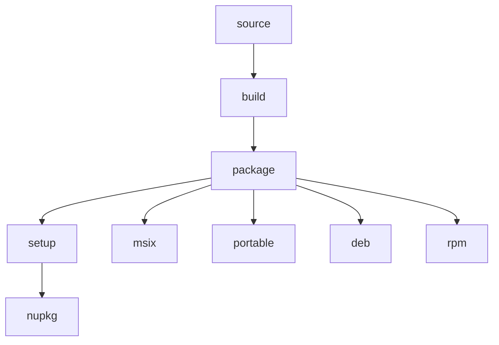

# 🛠️ bsys6

This repository should make it easy to build LibreWolf and various things
arround it, via Docker or directly on your system. (Work in Progress, currently
used in combination with
[bsys5](https://gitlab.com/librewolf-community/browser/bsys5))

## Setup

1. Clone this repository
   `git clone https://gitlab.com/librewolf-community/browser/bsys6.git`
2. _(optional)_ Add the checked out repository to your `PATH` to have the
   `bsys6` command available everywhere

## Usage

Right now this repository is only meant to be used on a x86_64 Linux system. You
always run `./bsys6`, followed by a chain of commands you want to run. The most
important commands are the following, a arrow indicates a dependency to another
command:

To view all commands, run `./bsys6 help`. Commands can be customized by setting
environment variables, most importantly:

| Environment variable | Description                                                                                          | Possible values (bold is default)                                                                           |
| -------------------- | ---------------------------------------------------------------------------------------------------- | ----------------------------------------------------------------------------------------------------------- |
| `TARGET`             | The platform you want to build for.                                                                  | **`linux`** `windows`                                                                                       |
| `ARCH`               | The architecture that you want to build for.                                                         | **`x86_64`** `arm64` `i686`                                                                                 |
| `VERSION`            | The version of LibreWolf to build.                                                                   | **`[latest version]`** [`[version tag]`](https://gitlab.com/librewolf-community/browser/source/-/releases). |
| `WORKDIR`            | The directory where the source code should be downloaded to and where the compilation should happen. | **`~/.local/share/bsys6/work`** `[any directory]`                                                           |

For actually building LibreWolf, there are two options available:

### Building with Docker

1. Run `./bsys6_docker <COMMAND>`. The available commands can be found above and
   the resulting artifact will be placed in your current directory.

   This will automatically download a prebuilt docker image as a build
   environment. If you want to build the image yourself, run
   `./bsys6 build_image`, optionally with the `TARGET` environment variable set
   to specify which image you want to build.

### Building directly on your system

1. Prepare all the dependencies for your system. You can do that by running
   `./bsys6 prepare`.

   This step is only supported on Arch and Debian based systems, you will have
   to install the dependencies manually on other systems. If you want to
   cross-compile, also already set the `TARGET` environment variable to the
   platform you want to target before that to ensure all necessary dependencies
   are installed.

2. Run `./bsys6 <COMMAND>`. The available commands can be found above and the
   resulting artifact will be placed in your current directory.

## Development

### Structure

| Directory          | Contents                                                                                                | Arguments                                        | How to include |
| ------------------ | ------------------------------------------------------------------------------------------------------- | ------------------------------------------------ | -------------- |
| `src/{command}.sh` | Commands that can be run by the user with `./bsys6/{command}.sh`. Can export new environment variables. | Via environment variable                         | With `source`  |
| `src/exports/*.sh` | Scripts that export environment variables, but shouldn't be run directly by the user.                   | Via environment variable                         | With `source`  |
| `src/utils/*.sh`   | Scripts that don't export environment variables and shouldn't be run directly by the user.              | Via environment variable or positional arguments | Run directly   |

## License

This Source Code Form is subject to the terms of the Mozilla Public License, v.
2.0. If a copy of the MPL was not distributed with this file, You can obtain one
at http://mozilla.org/MPL/2.0/.
